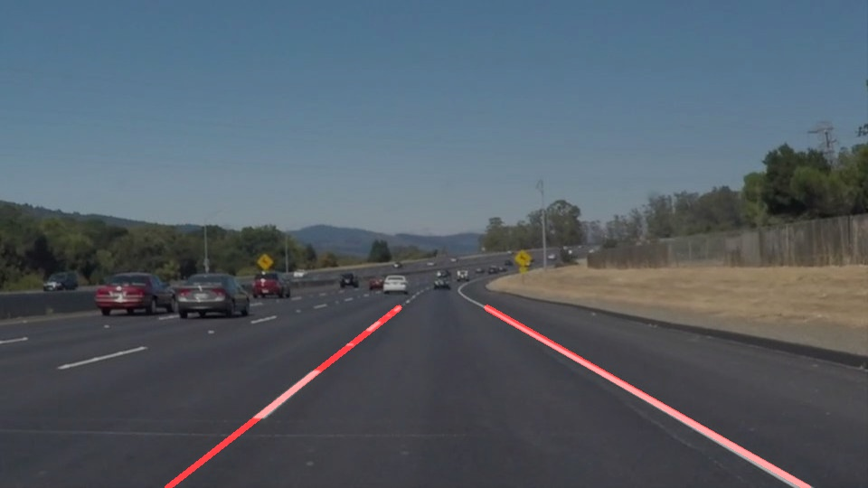
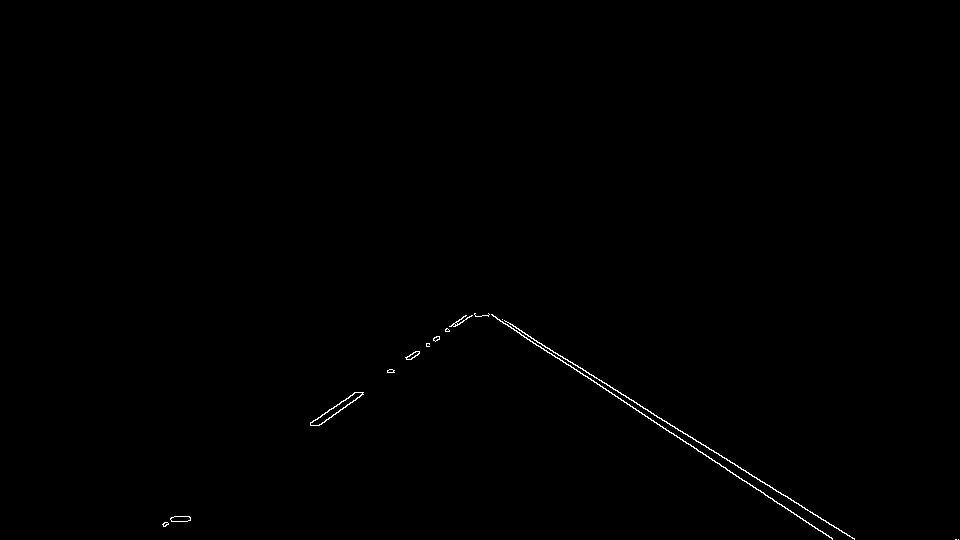

# **Finding Lane Lines on the Road** 

---

**Finding Lane Lines on the Road**

When we drive, we use our eyes to decide where to go.  The lines on the road that show us where the lanes are act as our constant reference for where to steer the vehicle.  Naturally, one of the first things we would like to do in developing a self-driving car is to automatically detect lane lines using an algorithm.

In order to detect Lane lines, I followed the below pipeline. This Pipeline is specific to the test videos used in this project. 

This project is implemented in Python using OpenCV. 

---

### 1. Pipeline

My pipeline consisted of following steps. First, I converted the images to grayscale, then I applied Gaussian blur on grayscale images to smooth. 

Third step is extracting strong edges using Canny edge detection. As we know, lanes are always in bottom half of the image/video, masking with a polygon will make the unwanted edges go away. Taking in account that lanes are always white or yellow, I also performed color based masking and futher customised the region of interest. The output uploaded here are without color thresholding, one can try that by uncommenting the respective step in region of interest selection code. 

Performing Hough transform on masked edge image helps us get all the lines available in the image. The parameters used here are specific to these images. In the below image, these lines are shown by overwriting the original image, the solid lane give perfect lines but the left one ends up in line segments. 

In order to draw a single line on the left and right lanes, I modified the draw_lines() function by by sorting the left and right slopes and respective lane centers. To improvise this, I also ignored the extreme horizontal and vertical lines by including only useful slopes. The final outcome looks like below 

The potential shortcoming would be that this pipeline is highly sensitive to lighting conditions like showdows of trees giving extra edges in lane area. 

Other noises like pits and bumps close to margins of lanes. These cause psuedo lines and disturb the slope of final lane lines.

###  Improvements

There is always a room for improving drawlines() method to avoid unwanted lines obtained from Hough transform

I would like to also think of some pre-processing where we can choose Canny edge thresholds, Hough parameters and color thresholds. That way, we can customise the lane parameters for different lighting conditions.

## Directory

- **test_images**
  - Contains some simple test images to try and process
- **test_images_output**
  - Contains the test images with lane lines drawn on
- **examples**
  - Contains the intermediate results of pipeline for one test image
- **test_videos**
  - Contains some simple test videos 
- **test_videos_output**
  - Contains the test videos with lane lines drawn on
- **LaneLines.ipynb**
  - Logic

